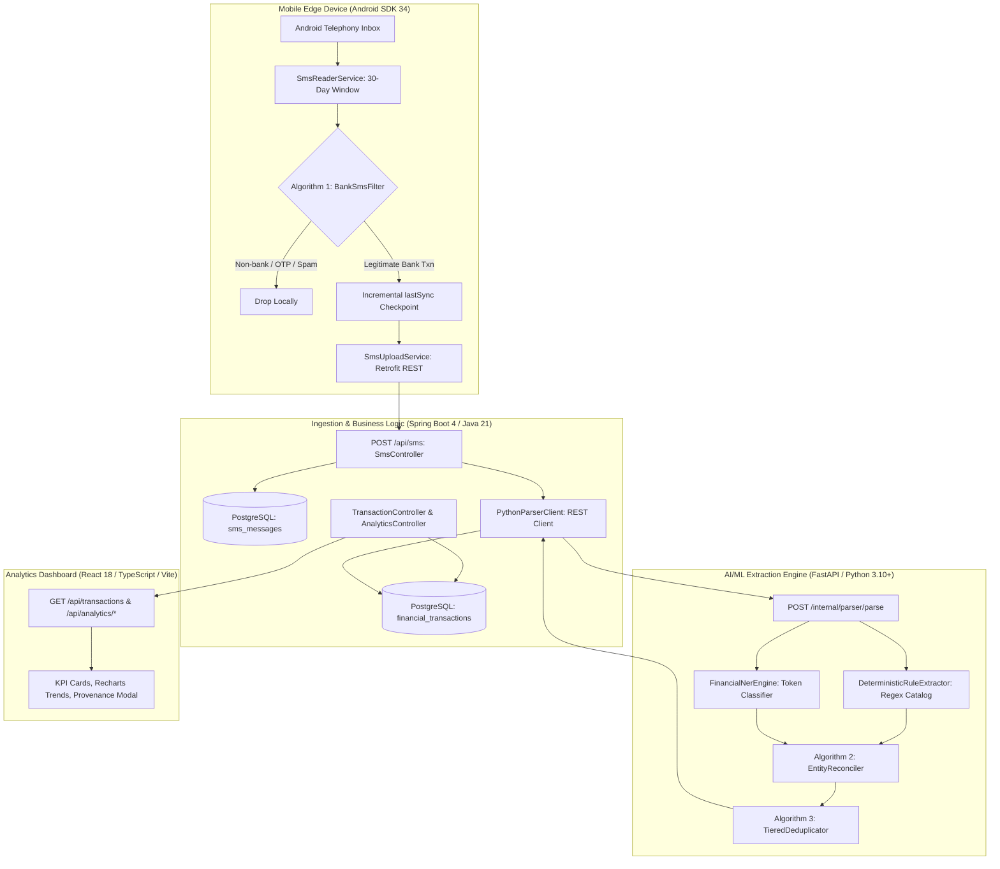

# FinSight AI (SMS2Finance) — System Architecture

> **Document Scope**: Multi-tier architecture, system interactions, synchronization integrity, and security boundaries.  
> **Related Implementations**: [`sms-android/`](file:///c:/Users/HP/Downloads/SMS2Finance/sms-android), [`smssyncserverBACKEND/`](file:///c:/Users/HP/Downloads/SMS2Finance/smssyncserverBACKEND), [`ai-ml/`](file:///c:/Users/HP/Downloads/SMS2Finance/ai-ml), [`frontend/`](file:///c:/Users/HP/Downloads/SMS2Finance/frontend)

---

## 1. High-Level Architecture Diagram



---

## 2. Multi-Tier Subsystem Specifications

### 2.1 Tier 1: Mobile Edge Subsystem (`sms-android`)
* **Primary Language**: Java (Android SDK 34 / Java 17).
* **Core Responsibilities**:
  1. **Telephony Access**: Queries `Telephony.Sms.CONTENT_URI` with runtime `READ_SMS` permission.
  2. **Sliding Window Filtering**: Confines historical scans to the preceding 30 days via `DateUtil.isWithinLastThirtyDays()`.
  3. **Algorithm 1 Edge Filtering**: Executes `BankSmsFilter.isBankTransaction()` to evaluate bank headers ($\mathcal{H}_{bank}$), reject promotional spam and isolated OTPs ($\mathcal{K}_{exclude}$), verify financial transaction triggers ($\mathcal{K}_{txn}$), and validate currency regex patterns.
  4. **Strict Checkpointing**: Reads `lastSync` from Android `SharedPreferences`. Messages with timestamps $\le lastSync$ are ignored during incremental synchronization.
  5. **Sequential Oldest-to-Newest Ingestion**: Re-sorts filtered records chronologically ascending before dispatching HTTP POST requests via Retrofit. The `lastSync` checkpoint in `SyncPreference` is advanced **only after the server returns an HTTP 200 OK**.

### 2.2 Tier 2: Ingestion & Core API Subsystem (`smssyncserverBACKEND`)
* **Primary Language**: Java 21 / Spring Boot 4.
* **Core Responsibilities**:
  1. **Raw SMS Ingestion**: `SmsController` exposes `POST /api/sms`. Accepts `{sender, message, timestamp}` and stores the message in the `sms_messages` table with an initial status of `PENDING`.
  2. **Orchestration**: `SmsService` invokes `PythonParserClient` via Spring's `RestClient` to call `POST /internal/parser/parse` on the Python ML service.
  3. **Relational Persistence**: Upon successful extraction, the structured record is mapped to `TransactionEntity` and persisted in the `financial_transactions` table with full extraction provenance (`extractionConfidence`, `parserVersion`, `validationStatus`).
  4. **Query & Analytics APIs**:
     - `TransactionController`: Supports multi-criteria querying (filtering by bank, debit/credit type, text search, and account suffix), transaction detail retrieval, and account summaries.
     - `AnalyticsController`: Computes monthly spending and income trends, top merchant expenditure distributions, and bank-wise transaction breakdowns.

### 2.3 Tier 3: Information Extraction & ML Subsystem (`ai-ml`)
* **Primary Language**: Python 3.10+ / FastAPI.
* **Core Responsibilities**:
  1. **Deterministic Rule Extraction**: `DeterministicRuleExtractor` (`rules/rule_extractor.py`) evaluates an extensive catalog of regular expressions (`rules/regex_catalog.py`) for amounts, Indian bank headers, RRNs, account numbers, UPI VPAs, and balances.
  2. **Contextual Token Classification**: `FinancialNerEngine` (`nlp/ner_engine.py`) predicts high-variance tokens such as variable merchant names and contextual intent indicators.
  3. **Algorithm 2 Entity Reconciliation**: `EntityReconciler` (`normalization/reconciliation.py`) synthesizes candidate extractions from regex and NER models. Strict deterministic priority is enforced for structural fields (`AMOUNT`, `RRN`, `ACC_NUM`, `UPI_ID`), while contextual priority is granted to high-variance fields (`MERCHANT`, `TXN_TYPE`).
  4. **Algorithm 3 Tiered Deduplication**: `TieredDeduplicator` (`deduplication/tiered_dedup.py`) runs a two-tier deduplication check:
     - Level 1: Deterministic unique key match on RRN ($\ge 6$ digits).
     - Level 2: Composite fuzzy-temporal match ($Amount \times Type \times AccLast4 \times \Delta t \times \text{Jaro-Winkler}(\text{Merchant}) \ge 0.85$).

### 2.4 Tier 4: Client Dashboard Subsystem (`frontend`)
* **Primary Language**: React 18 / TypeScript / Vite / Tailwind CSS.
* **Core Responsibilities**:
  1. **Financial Overview**: Displays KPI metrics (Total Spent, Total Received, Net Liquidity, Transaction Volume).
  2. **Visual Analytics**: Interactive Recharts components visualizing spending/income trajectories over time, bank distributions, and top merchants.
  3. **Transaction Explorer**: Full-featured tabular explorer featuring live search, debit/credit badges, bank filters, and account selector.
  4. **Extraction Provenance Inspector**: A modal revealing extraction details (values, confidence percentages, extraction source badges: `NER`, `REGEX`, `RULE`, `RECONCILED`).
  5. **Live Ingestion Feed**: Monitor displaying raw SMS statuses (`PARSED`, `PENDING`, `SKIPPED_NON_TXN`, `DUPLICATE_DROPPED`).

---

## 3. End-to-End Data Flow Sequence

```text
Sequence of Execution:
1. Android User triggers "Sync SMS" in MainActivity.
2. SmsReaderService queries Telephony.Sms.
3. For each SMS:
   - Check if within 30 days.
   - Check if timestamp > lastSync.
   - BankSmsFilter evaluates (Bank header, exclusions, intent, currency).
4. Retained SMS are sorted oldest-to-newest.
5. SmsUploadService sends SMS sequentially:
   - POST /api/sms -> Spring Boot SmsController.
   - Persist to PostgreSQL (sms_messages) -> ID created.
   - PythonParserClient sends POST /internal/parser/parse -> Python FastAPI.
   - Regex + NER + Algorithm 2 Reconciliation -> Extracted entities returned.
   - Spring Boot saves TransactionEntity to PostgreSQL (financial_transactions).
   - If HTTP 200 returned -> Android updates lastSync in SharedPreferences.
6. React Frontend calls GET /api/transactions and /api/analytics/* to update views.
```

---

## 4. Synchronization Correctness & Invariants

To guarantee that no financial transactions are lost or duplicated during intermittent network conditions:

* **Strict Ordering**: Messages are always synchronized in chronological order: **Oldest $\rightarrow$ Newest**.
* **Success-Gated Checkpointing**: The `lastSync` checkpoint in Android `SharedPreferences` is updated **only after** an individual HTTP upload succeeds. If an upload fails midway due to network loss, `lastSync` remains pinned at the last acknowledged message timestamp.
* **Idempotency**: In the event that a device re-transmits an already-ingested message, the backend deduplication logic (Algorithm 3) drops the duplicate before it creates redundant ledger entries.

---

## 5. Security and Network Boundaries

```text
+-----------------------------+
|    Untrusted Mobile Edge    |  (Android App on Cellular/WiFi)
+-----------------------------+
              │  TLS / HTTPS (REST API)
              ▼
+-----------------------------+
|    Application Gateway      |  (Spring Boot Backend: 8080)
|    - CORS Config            |
|    - Parameter Validation   |
+-----------------------------+
       │              │
       │ Internal Net │ Private Database Connection
       ▼              ▼
+---------------+   +------------------------------------+
|  FastAPI ML   |   |        PostgreSQL Database         |
|  (Port 8000)  |   |  (sms_messages, transactions)      |
+---------------+   +------------------------------------+
```

* **Frontend Isolation**: The React frontend connects strictly to Spring Boot. It has no credentials or direct networking access to PostgreSQL or the Python internal API.
* **Internal ML API**: `POST /internal/parser/parse` is intended for backend orchestration and does not require public internet exposure.
