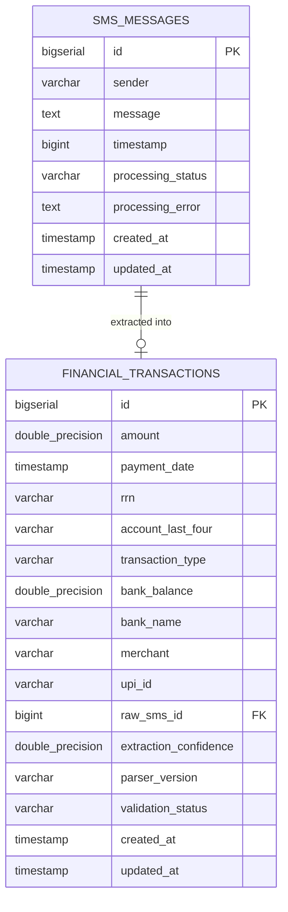

# FinSight AI (SMS2Finance) — Data Model & Relational Schemas

> **Document Scope**: Relational database schemas, PostgreSQL DDL statements, JPA mappings, indexing strategies, and privacy constraints.  
> **Related Entities**: [`SmsEntity.java`](file:///c:/Users/HP/Downloads/SMS2Finance/smssyncserverBACKEND/src/main/java/com/vedansh/smssyncserver/entity/SmsEntity.java), [`TransactionEntity.java`](file:///c:/Users/HP/Downloads/SMS2Finance/smssyncserverBACKEND/src/main/java/com/vedansh/smssyncserver/entity/TransactionEntity.java)

---

## 1. Relational Database Overview

FinSight AI utilizes **PostgreSQL** configured via Spring Data JPA with an `update` DDL lifecycle. The database schema separates raw audit logs from structured financial ledger entries:



---

## 2. Table Specifications & PostgreSQL DDL

### 2.1 Table: `sms_messages` (Raw Ingestion Audit Log)
Stores the raw notification payload received from the Android edge client for auditability, model fine-tuning, and re-parsing.

```sql
CREATE TABLE IF NOT EXISTS sms_messages (
    id BIGSERIAL PRIMARY KEY,
    sender VARCHAR(64) NOT NULL,
    message TEXT NOT NULL,
    timestamp BIGINT NOT NULL,
    processing_status VARCHAR(32) NOT NULL DEFAULT 'PENDING',
    processing_error TEXT,
    created_at TIMESTAMP WITHOUT TIME ZONE DEFAULT CURRENT_TIMESTAMP,
    updated_at TIMESTAMP WITHOUT TIME ZONE DEFAULT CURRENT_TIMESTAMP
);

CREATE INDEX IF NOT EXISTS idx_sms_timestamp ON sms_messages (timestamp);
CREATE INDEX IF NOT EXISTS idx_sms_status ON sms_messages (processing_status);
```

#### Field Explanations
* `sender`: Alphanumeric sender header as delivered by telephony (e.g., `HDFCBK`, `SBIINB`, `AXISBK`).
* `message`: Complete raw SMS body string.
* `timestamp`: Epoch millisecond timestamp of receipt on the Android device.
* `processing_status`: Lifecycle state (`PENDING`, `PARSED`, `SKIPPED`, `FAILED`, `DUPLICATE_DROPPED`).

---

### 2.2 Table: `financial_transactions` (Structured Financial Ledger)
Contains verified, normalized, and reconciled financial transaction records extracted from incoming messages.

```sql
CREATE TABLE IF NOT EXISTS financial_transactions (
    id BIGSERIAL PRIMARY KEY,
    amount DOUBLE PRECISION,
    payment_date TIMESTAMP WITHOUT TIME ZONE,
    rrn VARCHAR(64),
    account_last_four VARCHAR(16),
    transaction_type VARCHAR(16) NOT NULL,
    bank_balance DOUBLE PRECISION,
    bank_name VARCHAR(64),
    merchant VARCHAR(128),
    upi_id VARCHAR(128),
    raw_sms_id BIGINT,
    extraction_confidence DOUBLE PRECISION DEFAULT 0.0,
    parser_version VARCHAR(32) DEFAULT '1.0.0-hybrid',
    validation_status VARCHAR(32) DEFAULT 'VALID',
    created_at TIMESTAMP WITHOUT TIME ZONE DEFAULT CURRENT_TIMESTAMP,
    updated_at TIMESTAMP WITHOUT TIME ZONE DEFAULT CURRENT_TIMESTAMP
);

-- Production Indexes for Sub-Millisecond Aggregation
CREATE INDEX IF NOT EXISTS idx_txn_rrn ON financial_transactions (rrn);
CREATE INDEX IF NOT EXISTS idx_txn_payment_date ON financial_transactions (payment_date);
CREATE INDEX IF NOT EXISTS idx_txn_bank_name ON financial_transactions (bank_name);
CREATE INDEX IF NOT EXISTS idx_txn_raw_sms_id ON financial_transactions (raw_sms_id);
CREATE INDEX IF NOT EXISTS idx_txn_account ON financial_transactions (account_last_four);
```

#### Field Explanations
* `amount`: Numeric transaction value (in INR).
* `payment_date`: Resolved ISO local date/time of the transaction.
* `rrn`: Retrieval Reference Number / UTR / Banking reference string.
* `account_last_four`: Exactly the last four digits of the source or target account/card (e.g., `4821`).
* `transaction_type`: Direction of funds (`DEBIT`, `CREDIT`, or `UNKNOWN`).
* `bank_balance`: Post-transaction ledger or available balance extracted from the SMS body.
* `bank_name`: Normalized name of the issuing bank (e.g., `HDFC Bank`, `State Bank of India`).
* `merchant`: Beneficiary merchant or counterparty name (e.g., `Swiggy`, `Amazon India`).
* `upi_id`: Payee Virtual Payment Address (e.g., `swiggy@okhdfcbank`).
* `raw_sms_id`: Foreign key reference to `sms_messages.id`.
* `extraction_confidence`: Macro confidence score ($\in [0.0, 1.0]$) computed during Algorithm 2 reconciliation.
* `parser_version`: Tracking identifier for the extraction model release (e.g., `1.0.0-hybrid`).
* `validation_status`: Consistency classification (`VALID`, `PARTIAL`, `FLAGGED`).

---

## 3. Database Indexing Strategy

1. **`idx_txn_rrn`**: Essential for sub-millisecond execution of Algorithm 3 Level-1 deterministic deduplication.
2. **`idx_txn_payment_date`**: Accelerates dashboard range filters (e.g., weekly and monthly cash flow charts).
3. **`idx_txn_bank_name` & `idx_txn_account`**: Accelerates account-specific filtering in the dashboard selector.
4. **`idx_txn_raw_sms_id`**: Links structured ledger records back to raw audit logs in constant time ($O(1)$).

---

## 4. Privacy & Data Integrity Principles

* **No Amount-Only Unique Constraints**: Legitimate recurring payments (e.g., two distinct Rs. 100 payments on the same afternoon) must never be merged. Unique constraints rely on RRN or composite temporal criteria (Algorithm 3).
* **Strict Masking of PII**: Real bank account numbers are never persisted in full; only `account_last_four` is retained.
* **Audit Trail Preservation**: Raw SMS records in `sms_messages` remain un-mutated once inserted to guarantee complete financial auditability.
